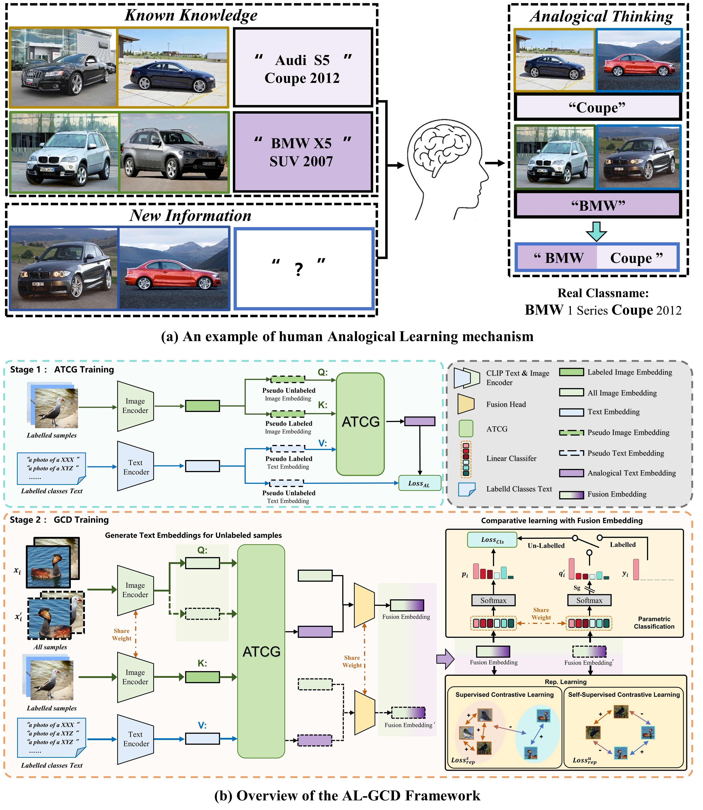

# AnaLogical-GCD (AL-GCD)
### Learning Like Humans: Analogical Concept Learning for Generalized Category Discovery

<p align="center">
  <a href="https://arxiv.org/abs/2603.19918">
    
  </a>
</p>

<p align="center">
  Official implementation of Learning Like Humans: Analogical Concept Learning for Generalized Category Discovery.<br>
  By Jizhou Han, et. al.
</p>




## 🧠 Method Overview
AL-GCD integrates visual and textual information for discovery via **analogical learning**. Concretely, it leverages a learned generator to synthesize textual concepts for unlabeled samples and fuses them with visual features for contrastive discovery. Our pipeline consists of two stages:
### Stage 1: ATCG Training (Pseudo-GCD)
We first construct a labeled **visual–text knowledge base**. Based on this knowledge base, we simulate a pseudo-GCD setting to train the **Analogical Textual Concept Generator (ATCG)**, enabling it to generate **analogical text embeddings** for unlabeled-like samples.
### Stage 2: AL-GCD Training (GCD Training)
In the actual GCD training stage, ATCG produces textual embeddings for unlabeled samples. These embeddings are fused with visual features to form fusion representations, which are then optimized via contrastive learning to support category discovery.


**One-command runner:** In this codebase, **Stage 1 + Stage 2 are integrated** and can be executed by a single bash script.

**Prototype-as-Knowledge-Base:** We additionally provide an efficient variant that replaces the sample-level knowledge base with **one prototype per class**, significantly reducing memory footprint and retrieval cost, thus accelerating training and inference—particularly on large-scale or fine-grained benchmarks.


---


## 📦 Dependencies

```
pip install -r requirements.txt
```

### kmeans_pytorch Installation
Our pipeline (SelEx-style clustering) relies on [kmeans_pytorch](https://github.com/subhadarship/kmeans_pytorch) for cluster assignment. To reproduce paper-level results, please install it as follows:

```
cd AnaLogical-GCD
git clone https://github.com/subhadarship/kmeans_pytorch
cd kmeans_pytorch
pip install --editable .
```

----

## 🗂️ Datasets
We conduct experiments on six benchmarks, including fine-grained and generic datasets:

#### Fine-grained:    
* [CUB](https://drive.google.com/drive/folders/1kFzIqZL_pEBVR7Ca_8IKibfWoeZc3GT1), [Stanford Cars](https://ai.stanford.edu/~jkrause/cars/car_dataset.html), [FGVC-Aircraft](https://www.robots.ox.ac.uk/~vgg/data/fgvc-aircraft/) and [Herbarium19](https://www.kaggle.com/c/herbarium-2019-fgvc6)

#### Generic:
* [CIFAR-100](https://pytorch.org/vision/stable/datasets.html) and [ImageNet](https://image-net.org/download.php)


---


## 🔧 Config

Set paths to datasets, pre-trained models and desired log directories in ```config.py```

Set ```SAVE_DIR``` (logfile destination) and ```PYTHON``` (path to python interpreter) in ```bash_scripts``` scripts.

---


## 🚀 Scripts

### 🧩 One-command: Train ATCG + Train GCD

We provide a one-command runner that sequentially executes:
1) **ATCG training (Pseudo-GCD)**  
2) **AL-GCD training (GCD Training)**  
3) evaluation on **best** and **final** checkpoints.

Run:
```
bash Train_AL.sh
```
In this codebase, ATCG training and AL-GCD training are integrated into a single training entry.
Train_AL.sh is the recommended launcher for reproducing our main results.

### ⚡ Prototype-as-Knowledge-Base (Fast Variant)

We additionally provide a Prototype-as-Knowledge-Base mode, where the knowledge base stores one prototype per class
(instead of all class samples). This can significantly reduce memory and compute, accelerating both training and inference.

Run (prototype KB version):

```
bash Train_AL_proto.sh
```

**Note:** We recommend using the proto-based version in practice. It achieves comparable performance while substantially reducing training time and improving overall efficiency—especially on ImageNet-100, Herbarium19, and CIFAR-100.

---

## ✅ Evaluation & Released Weights

You can evaluate the released checkpoints via:
```
bash Test.sh
```

We provide released weight for both KB settings:
- **All-sample Knowledge-Base** weights (Baidu Netdisk): [link](https://pan.baidu.com/s/1AXkd5Bk-N44KXrtcLEt27g?pwd=bv77)
- **Proto-based Knowledge-Base** weights (Baidu Netdisk): [link](https://pan.baidu.com/s/15QQIFQlIX2f_X6OgQ5avHQ?pwd=rvdf)
- **All-sample Knowledge-Base and Proto-based Knowledge-Base** (Google Drive): [link](https://drive.google.com/drive/folders/1F7uXulC7R9riKMg3RDswRR8QBP-hY09b?usp=drive_link)

---

## 📊 Results

For each dataset, we report results under two Knowledge-Base settings:

- **All-sample Knowledge-Base** (run with `bash Train_AL.sh`)
- **Proto-based Knowledge-Base** (run with `bash Train_AL_proto.sh`)

Each entry is reported as **All / Old / New** accuracy (%).  
We report both the **Best** result and the **Final** result.


### All-sample Knowledge-Base (All / Old / New)

<table>
  <tr>
    <td><b>Dataset</b></td>
    <td align="center" colspan="3"><b>Best</b></td>
    <td align="center" colspan="3"><b>Final</b></td>
  </tr>
  <tr>
    <td></td>
    <td align="center"><b>All</b></td>
    <td align="center"><b>Old</b></td>
    <td align="center"><b>New</b></td>
    <td align="center"><b>All</b></td>
    <td align="center"><b>Old</b></td>
    <td align="center"><b>New</b></td>
  </tr>

  <tr>
    <td>CUB-200</td>
    <td align="center">85.7</td>
    <td align="center">79.1</td>
    <td align="center">89.0</td>
    <td align="center">85.4</td>
    <td align="center">79.5</td>
    <td align="center">88.4</td>
  </tr>

  <tr>
    <td>Stanford Cars</td>
    <td align="center">81.5</td>
    <td align="center">92.0</td>
    <td align="center">76.4</td>
    <td align="center">81.5</td>
    <td align="center">92.0</td>
    <td align="center">76.4</td>
  </tr>

  <tr>
    <td>FGVC-Aircraft</td>
    <td align="center">67.7</td>
    <td align="center">65.8</td>
    <td align="center">68.6</td>
    <td align="center">67.3</td>
    <td align="center">65.4</td>
    <td align="center">68.3</td>
  </tr>

  <tr>
    <td>Herbarium19</td>
    <td align="center">52.7</td>
    <td align="center">58.0</td>
    <td align="center">49.9</td>
    <td align="center">52.3</td>
    <td align="center">57.7</td>
    <td align="center">49.3</td>
  </tr>

  <tr>
    <td>CIFAR-100</td>
    <td align="center">80.6</td>
    <td align="center">86.3</td>
    <td align="center">69.1</td>
    <td align="center">80.4</td>
    <td align="center">86.2</td>
    <td align="center">68.6</td>
  </tr>

  <tr>
    <td>ImageNet-100</td>
    <td align="center">95.3</td>
    <td align="center">97.5</td>
    <td align="center">94.2</td>
    <td align="center">95.3</td>
    <td align="center">97.5</td>
    <td align="center">94.2</td>
  </tr>
</table>


### Proto-based Knowledge-Base (All / Old / New)

<table>
  <tr>
    <td><b>Dataset</b></td>
    <td align="center" colspan="3"><b>Best</b></td>
    <td align="center" colspan="3"><b>Final</b></td>
  </tr>
  <tr>
    <td></td>
    <td align="center"><b>All</b></td>
    <td align="center"><b>Old</b></td>
    <td align="center"><b>New</b></td>
    <td align="center"><b>All</b></td>
    <td align="center"><b>Old</b></td>
    <td align="center"><b>New</b></td>
  </tr>

  <tr>
    <td>CUB-200</td>
    <td align="center">84.9</td>
    <td align="center">79.9</td>
    <td align="center">87.4</td>
    <td align="center">84.5</td>
    <td align="center">77.8</td>
    <td align="center">87.9</td>
  </tr>

  <tr>
    <td>Stanford Cars</td>
    <td align="center">80.9</td>
    <td align="center">91.6</td>
    <td align="center">75.8</td>
    <td align="center">80.9</td>
    <td align="center">92.1</td>
    <td align="center">75.6</td>
  </tr>

  <tr>
    <td>FGVC-Aircraft</td>
    <td align="center">66.4</td>
    <td align="center">64.6</td>
    <td align="center">67.3</td>
    <td align="center">66.0</td>
    <td align="center">62.8</td>
    <td align="center">67.6</td>
  </tr>

  <tr>
    <td>Herbarium19</td>
    <td align="center">49.7</td>
    <td align="center">58.2</td>
    <td align="center">45.1</td>
    <td align="center">48.0</td>
    <td align="center">56.3</td>
    <td align="center">43.6</td>
  </tr>

  <tr>
    <td>CIFAR-100</td>
    <td align="center">79.1</td>
    <td align="center">84.5</td>
    <td align="center">68.2</td>
    <td align="center">79.1</td>
    <td align="center">84.5</td>
    <td align="center">68.2</td>
  </tr>

  <tr>
    <td>ImageNet-100</td>
    <td align="center">93.7</td>
    <td align="center">96.9</td>
    <td align="center">92.1</td>
    <td align="center">93.5</td>
    <td align="center">97.2</td>
    <td align="center">91.6</td>
  </tr>
</table>

- Detailed logs: [`Logs_Save/ALGCD/`](Logs_Save/ALGCD/) (including `All_Samples/` and `Proto_Based/`); All results are obtained with a fixed seed (seed = 1).


### Knowledge-Base Size

**All-sample Knowledge-Base.** We populate the KB with **all labeled samples** and their **augmented views**.  
Therefore, the number of KB entries equals **2 × (labeled samples)**.

**Proto-based Knowledge-Base.** We populate the KB with **one prototype per known (labeled) class**.  
Therefore, the number of KB entries equals **known classes**.

<table>
  <thead>
    <tr>
      <th align="center">Knowledge-Base Setting</th>
      <th align="center">CUB-200</th>
      <th align="center">Stanford Cars</th>
      <th align="center">FGVC Aircraft</th>
      <th align="center">Herbarium19</th>
      <th align="center">CIFAR-100</th>
      <th align="center">ImageNet-100</th>
    </tr>
  </thead>
  <tbody>
    <tr>
      <td align="center"><b>All-sample</b></td>
      <td align="center">2,740</td>
      <td align="center">3,744</td>
      <td align="center">3,076</td>
      <td align="center">17,482</td>
      <td align="center">39,744</td>
      <td align="center">63,464</td>
    </tr>
    <tr>
      <td align="center"><b>Proto-based</b></td>
      <td align="center">100</td>
      <td align="center">98</td>
      <td align="center">50</td>
      <td align="center">341</td>
      <td align="center">80</td>
      <td align="center">50</td>
    </tr>
  </tbody>
</table>

---


##  🧾 Citation

If you use this code in your research, please consider citing our paper:

```
@article{zhou2026analogical,
      title={Learning Like Humans: Analogical Concept Learning for Generalized Category Discovery}, 
      author={Jizhou Han and Chenhao Ding and Yuhang He and Qiang Wang and Shaokun Wang and SongLin Dong and Yihong Gong},
      journal={arXiv preprint arXiv:2603.19918},
      year={2026}
}
```

## 🎁 Acknowledgements

This codebase is primarily built upon the excellent open-source repositories of
[GCD](https://github.com/sgvaze/generalized-category-discovery), [SelEx](https://github.com/SarahRastegar/SelEx), and [SimGCD](https://github.com/CVMI-Lab/SimGCD).
We sincerely thank the authors for their valuable contributions to the community.

## 📧 Contact

If you have any questions or would like to discuss this work, please feel free to reach out:

Jizhou Han (Jizhou_han@stu.xjtu.edu.cn)

